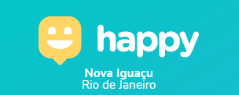
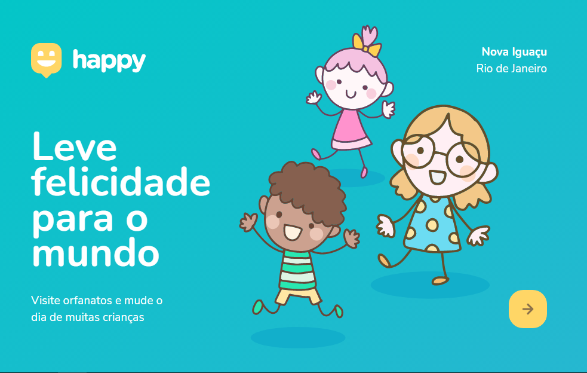
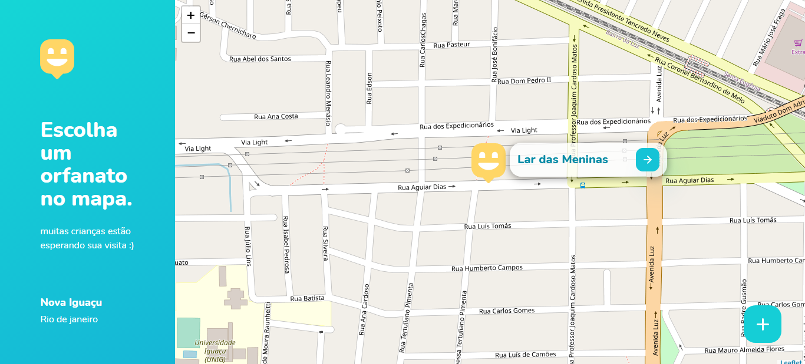
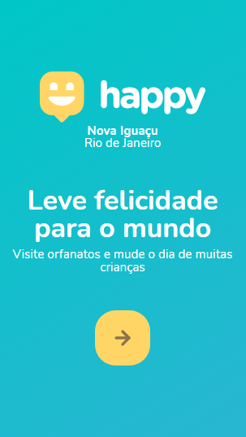
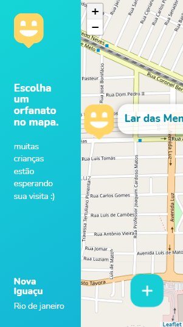

# Happy👶

Um localizador de orfanatos, o projeto foi inspirado no dia das crianças e foi feito na 3º maratona NLW da Rocketseat. O projeto tem como objetivo incentivar
a visita de pessoas a crianças em orfanatos, pois faz uma diferença gigantesca o compartilhamanto de amor e o setnimento de que foram lembradas a essas crianças,
principalmente no dia das crianças.

## Skilss
&nbsp;
&nbsp;
&nbsp;
&nbsp;
&nbsp;

# Exemplos

## Desktop
 

## Mobile

